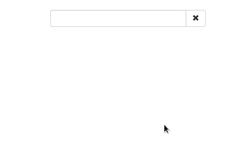

# FRH React Phone Lookup


[](https://badge.fury.io/js/frh-react-phone-lookup)
[](https://david-dm.org/FarmRadioHangar/react-phone-lookup#info=dependencies)
[](https://david-dm.org/FarmRadioHangar/react-phone-lookup#info=devDependencies)

React component for looking up phone book entries by name or number. The user can select a number to call either by 

* typing part of the person's name or number, and selecting the callee from the drop-down list; or 
* entering a valid phone number (for numbers that are not in the phone book).



## Demo

Try the demo [here](http://farmradiohangar.github.io/react-phone-lookup/public/examples/).

## Installation

```
npm install --save frh-react-phone-lookup
```

## Usage

```js
import React       from 'react'
import ReactDOM    from 'react-dom'
import PhoneLookup from 'frh-react-phone-lookup'

class App extends React.Component {
  constructor(props) {
    super(props)
  }
  render() {
    return (
      <PhoneLookup entries ={[
        {
          name  : 'Danae Rothstein',
          phone : '+1-202-555-0125'
        },
        {
          name  : 'Leslee Bunnell',
          phone : '+1-202-555-0145'
        },
        {
          name  : 'Voncile Reams',
          phone : '202-555-0121'
        }
      ]}/>
    )
  }
}

ReactDOM.render(
  <App />,
  document.getElementById('main')
)
```

## Props

| Property         | Type                     | Description   | Default      | 
| ---------------- | ------------------------ | ------------- | ------------ |
| maxResults       | Number                   | The maximum number of items visible in the list of results. | `10`           |
| entries          | Array                    | An array of phone book entries. Each object in this array must have a `name`, and a `phone` property. | `[]`           |
| resultsComponent | Component                | The component responsible for rendering the list of results. | See 'Customization' |
| inputComponent   | Component                | The input field component.  | See 'Customization' |
| regexp           | RegExp                   | The regular expression used to determine when the user input is a valid phone number. | `/^(\+?[0-9]{1,3}\-?|0)[0123456789]{9}$/` |
| onCallNumber     | Function                 | A callback that runs when the user clicks the 'Call' button. | `number => { console.log(number) }` | 

### Required props

Technically, all props are optional, but you should at least provide your own `entries` array and `onCallNumber` hook for any useful implementation.

#### Format of the entries array

```js
[
  {
    name  : string
    phone : string 
  }
]
```

## Customization

To change the appearance and behavior of the results drop-down or the input field, you can provide your own implementation of these components as follows:

```js
  <PhoneLookup 
    resultsComponent = {MyResultsComponent}
    inputComponent   = {MyInputComponent}
    entries          = {[ ... ]} />
```

See below for an explanation of the various props that are passed to these components.

### Results 

#### Props

| Property          | Type                     | Description   | 
| ----------------- | ------------------------ | ------------- |
| onSelectionChange | Function                 | Should be called when the user selects a result from the list with the selected entry as the parameter. |
| results           | Array                    | The array of phone book entries that should appear in the list. |

#### Default implementation

```js
class DefaultResults extends React.Component {
  constructor(props) {
    super(props)
  }
  render() {
    const { results, onSelectionChange } = this.props
    return (
      <ul style={ulStyles}>
        {results.map((result, key) => {
          return (
            <li key={key}>
              <span style={{float: 'right'}}>
                {result.phone}
              </span>
              <a href='#' onClick={() => onSelectionChange(result)}>
                {result.name} 
              </a>
            </li>
          )
        })}
      </ul>
    )
  }
}
```

### Input

#### Props

| Property          | Type                     | Description   |  
| ----------------- | ------------------------ | ------------- | 
| hasEntry          | Boolean                  | Whether an entry is currently selected or not. |
| isValidNumber     | Boolean                  | Whether the entered value is a valid phone number or not. |
| value             | String                   | The current value. |
| onReset           | Function                 | Callback to reset the value. |
| onCallNumber      | Function                 | Callback to run when the user clicks the 'Call' button. |
| onChange          | Function                 | Change handler that receives either the value, or an event object. |

#### Default implementation

```js
class DefaultInput extends React.Component {
  constructor(props) {
    super(props)
  }
  render() {
    const { hasEntry, value, onChange, onReset, onCallNumber, isValidNumber } = this.props
    const inputStyle = hasEntry ? {
      backgroundColor: '#fff4a8'
    } : isValidNumber ? {
      backgroundColor: '#a8f4a8'
    } : {}
    return (
      <div>
        <input 
          type     = 'text'
          style    = {inputStyle}
          value    = {value}
          onChange = {onChange}
        />
        {(hasEntry || isValidNumber) && (
          <span>
            <button onClick={onReset}>Reset</button>
            <button onClick={onCallNumber}>Call</button>
          </span>
        )}
      </div>
    )
  }
}
```

### Example

See the [source code for the demo](https://github.com/FarmRadioHangar/react-phone-lookup/blob/master/js/examples/main.jsx) for an example of customization, using the Bootstrap framework.

## Contribute

* GitHub: https://github.com/FarmRadioHangar/react-phone-lookup
* Issue tracker: https://github.com/FarmRadioHangar/react-phone-lookup/issues

## License

BSD
